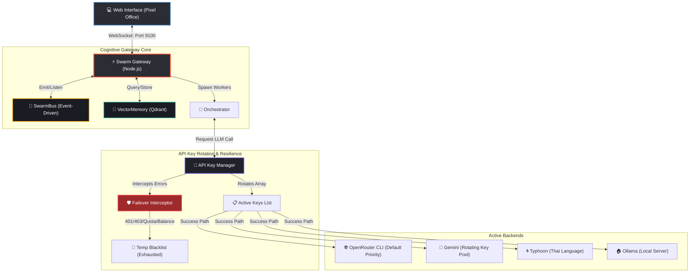

# 🐝 Bit-Office Swarm History & Search Hub

Welcome to the **Systematic Swarm History and Diagnostic Index**. This live documentation hub serves as the project's **NotebookLM-compatible index**, mapping out the chronological evolution of the Bit-Office autonomous AI swarm from infrastructure setup to advanced multi-agent cognitive failovers.

---

> [!IMPORTANT]
> **Interconnected Swarm Documentation Hub**:
> *   📁 **[Swarm History Index Portal](file:///D:/www/bit-office/docs/swarm-history/INDEX.md)**: Main entry point for the systematic Swarm documentation.
> *   🛠️ **[Swarm Design & Operations Hub](file:///D:/www/bit-office/docs/swarm-design/01-what-it-is/overview.md)**: Premium 12-module operational layout (What It Is, Prompting, Tokens, Failover).
> *   🔑 **[Swarm API Key & Services Registry](file:///D:/www/bit-office/docs/swarm-history/API_REGISTRY.md)**: Details of rotating keys, masking patterns, JHCIS/Drugmuk DBs, and discord tokens.
> *   🛡️ **[Self-Healing Failover & Error Guide](file:///D:/www/bit-office/docs/swarm-history/FAILOVER_GUIDE.md)**: Failover flowcharts, `failoverTo` configurations, and Thai natural language error translations.
> *   📂 **[Historical Reports Search Directory](file:///D:/www/bit-office/docs/swarm-history/REPORTS_INDEX.md)**: Searchable registry of daily reports and diagnostics.

---

## 🛰️ Real-Time System Status & Topology

Below is the current visual topology of the Bit-Office Swarm Gateway, illustrating the multi-agent orchestration, event-driven telemetry (`SwarmBus`), long-term vector database (`Qdrant`), and our newly implemented **Self-Healing API Rotator**.



---

## 🔑 Swarm API Key Status Registry

The following table documents the active configuration of backends and the auto-failover policies designed to keep agents online 24/7.

| Backend ID | Backend Name | Priority / Default | Health Status | Auto-Failover Rules | Target Model / Specs |
| :--- | :--- | :--- | :--- | :--- | :--- |
| `openrouter` | **OpenRouter CLI** | **1 - PRIMARY DEFAULT** | 🟢 Active | Routes through verified endpoint with rotation capability. | `anthropic/claude-3.5-sonnet:beta` |
| `gemini` | **Gemini (Rotating)** | 2 - Secondary | 🟡 Degradation Check | Automatically skips keys matching `leaked` / `400` / `quota` warnings. | `gemini-1.5-pro-latest` |
| `typhoon` | **Typhoon (Thai)** | 3 - Localized | 🟢 Active | Redirects all Thai language operations to Typhoon. | `typhoon-v1.5x-instruct` |
| `ollama-local` | **Ollama (Local)** | 4 - Fallback | 🟢 Running | Fallback when offline or no remote keys are available. | `llama3:latest` |
| `claude` | **Claude Direct** | 5 - Fallback | 🔴 Exhausted (Blacklisted) | Immediately bypassed by the `Failover Interceptor` to avoid agent halts. | `claude-3-5-sonnet` |

---

## 🛡️ Self-Healing Failover Mechanics & Error Mapping

The Cognitive Gateway has been fortified with a customized **Error Interceptor** (`apps/gateway/src/index.ts` and `packages/orchestrator/src/orchestrator.ts`). When an agent returns an error during task execution, it is routed through the following state machine:

```
[Agent Task Error]
       │
       ▼
[Translate to Thai via AgentErrorHandler.formatThai()]
       │
       ▼
[Match Error Pattern (Quota Exceeded / 401 Unauthorized / Insufficient Balance / leaked)]
       │
       ├──► YES: Flag API key in KeyManager -> Add to Temporary Blacklist -> Auto-select next active key
       └──► NO: Trigger Workspace Rollback via SnapshotManager -> Terminate Task
```

### Actionable Thai Guidance Translation Map

When the swarm encounters API or infrastructural issues, it avoids printing raw stack traces to non-technical operators. Instead, the `AgentErrorHandler` translates technical exceptions into actionable Thai guidance:

*   **RateLimitError / 429**: `"ขออภัย ระบบมีการเรียกใช้งานหนาแน่นเกินไปในขณะนี้ กำลังปรับการทำงานของบอทเพื่อเชื่อมต่อช่องทางสำรองโดยอัตโนมัติ"`
*   **TerminalQuotaError / Insufficient Balance**: `"โควต้าคีย์ API สำหรับโมเดลปัญญาประดิษฐ์นี้หมดแล้ว ระบบอัจฉริยะกำลังสลับไปใช้บัญชีสำรองเพื่อดำเนินการต่อทันที"`
*   **401 Unauthorized / invalid_api_key**: `"คีย์เข้าใช้งานโมเดลนี้ไม่ถูกต้อง หรือหมดอายุการเชื่อมต่อแล้ว กำลังดำเนินการดึงคีย์ใหม่เพื่อซ่อมแซมระบบบอท"`

---

## 📅 Chronological Phase Timeline

### 📍 Phase 9: Advanced Failover & Compilation Fixes (May 17, 2026 - Today)
*   **Accomplished**: Fixed the critical circular dependency where `agent-session.ts` imported `keyManager` from the gateway app. Migrated key reporting to the event emitter pipeline (`orchestrator.ts`). Fully synchronized OpenRouter API configurations across all containers.
*   **Key Learnings**: Shared libraries must remain decoupled from specific application scopes to compile reliably in isolated containers.
*   **Related Report**: [REPORT-2026-05-17.md](file:///d:/www/bit-office/.claude/planner/report/REPORT-2026-05-17.md)

### 📍 Phase 8: NotebookLM & Pixel Animations (May 16, 2026)
*   **Accomplished**: Built the `KnowledgeManager` to extract `MODULES:` and `FEATURES:` from agent logs on success. Persisted clean Markdown in `~/.bit-office/knowledge/`. Added dynamic agent character animations (`WALKING_TO_SERVER`, `DEBUGGING`, `DOCUMENTING`) to the frontend pixel layout.
*   **Key Learnings**: Knowledge graphs and auto-summaries prevent agent amnesia and enable developers to feed standard project states into NotebookLM.
*   **Related Reports**: 
    - [REPORT-2026-05-16-MISSION-COMPLETE.md](file:///d:/www/bit-office/.claude/planner/report/REPORT-2026-05-16-MISSION-COMPLETE.md)
    - [REPORT-2026-05-16-KNOWLEDGE.md](file:///d:/www/bit-office/.claude/planner/report/REPORT-2026-05-16-KNOWLEDGE.md)
    - [REPORT-2026-05-16-DIAGNOSTICS.md](file:///d:/www/bit-office/.claude/planner/report/REPORT-2026-05-16-DIAGNOSTICS.md)

### 📍 Phase 7: Gateway Port Auto-Scanning & Connection (May 15, 2026)
*   **Accomplished**: Upgraded the frontend configuration to scan and detect the running Docker gateway on port 9105, dynamically matching environments.
*   **Related Report**: [REPORT-2026-05-15.md](file:///d:/www/bit-office/.claude/planner/report/REPORT-2026-05-15.md)

### 📍 Phase 4-6: Docker Decoupling & Auto-Healing (May 13 - 14, 2026)
*   **Accomplished**: Isolated browser-only libraries from Node-specific orchestrators to ensure container builds succeeded. Integrated `SnapshotManager` to perform automatic workspace rollbacks on task failures.
*   **Related Reports**:
    - [REPORT-2026-05-14.md](file:///d:/www/bit-office/.claude/planner/report/REPORT-2026-05-14.md)
    - [REPORT-2026-05-13.md](file:///d:/www/bit-office/.claude/planner/report/REPORT-2026-05-13.md)

---

## 🔍 Historical Report Search Index

Use the index below to search and jump directly to any historical diagnostic report.

| Report Filename | Date | Key Topics & Search Tags | Diagnostic Status |
| :--- | :--- | :--- | :--- |
| [REPORT-2026-05-17.md](file:///d:/www/bit-office/.claude/planner/report/REPORT-2026-05-17.md) | **May 17, 2026** | `OpenRouter`, `Circular Dependency`, `Failover`, `401 Error`, `thClaws`, `Blacklist Clear` | ✅ SUCCESS |
| [REPORT-2026-05-16-MISSION-COMPLETE.md](file:///d:/www/bit-office/.claude/planner/report/REPORT-2026-05-16-MISSION-COMPLETE.md) | **May 16, 2026** | `Telemetry`, `Swarm Health`, `Activity Animations`, `Pixel Office` | ✅ SUCCESS |
| [REPORT-2026-05-16-KNOWLEDGE.md](file:///d:/www/bit-office/.claude/planner/report/REPORT-2026-05-16-KNOWLEDGE.md) | **May 16, 2026** | `KnowledgeManager`, `NotebookLM`, `Long-term Memory`, `MODULES`, `FEATURES` | ✅ SUCCESS |
| [REPORT-2026-05-16-DIAGNOSTICS.md](file:///d:/www/bit-office/.claude/planner/report/REPORT-2026-05-16-DIAGNOSTICS.md) | **May 16, 2026** | `Qdrant`, `Health Checks`, `Doctor Command`, `Vector Database` | ✅ SUCCESS |
| [REPORT-2026-05-15.md](file:///d:/www/bit-office/.claude/planner/report/REPORT-2026-05-15.md) | **May 15, 2026** | `Port 9105`, `WebSocket AUTH`, `Docker Gateway`, `Frontend Connection` | ✅ SUCCESS |
| [REPORT-2026-05-14.md](file:///d:/www/bit-office/.claude/planner/report/REPORT-2026-05-14.md) | **May 14, 2026** | `Isomorphic decoupling`, `Better-SQLite3`, `NextJS Container Build` | ✅ SUCCESS |
| [REPORT-2026-05-13.md](file:///d:/www/bit-office/.claude/planner/report/REPORT-2026-05-13.md) | **May 13, 2026** | `Docker native compilation`, `pnpm rebuild`, `npipe docker socket` | ✅ SUCCESS |

---

> [!TIP]
> **NotebookLM Ingestion**: To load the full context of the swarm project history, point your NotebookLM to the files in `C:\Users\LENOVO\.bit-office\knowledge\bit-office\PROJECT_KNOWLEDGE.md` alongside the markdown files listed in this directory.

---
*Developed & Indexed Autonomously by Antigravity Command Control.*
